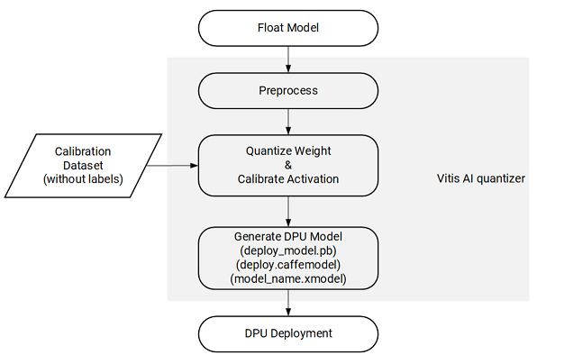
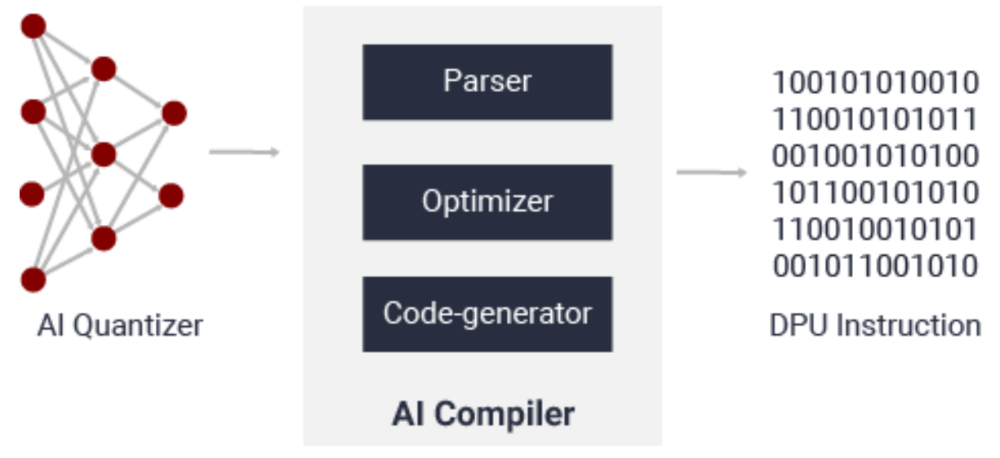

<!-- 
DO NOT add layout, it will prevent README.md to be render as index.html by GitHub pages
-->

# XUP Vitis AI Tutorial

This tutorial consists of several labs which covers four frameworks that Vitis-AI version **1.4.1** development tools support. The supported frameworks are: TensorFlow, TensorFlow2, PyTorch, and Caffe. AWS F1 is used as the target machine. All frameworks go through basic quantization and compilation steps. The compiler targets *DPUCADF8H* DPU which supports Alveo U200 board. Since the AWS F1 instance board has the same FPGA as the Alveo U200 board, the compiled model can be loaded into the FPGA and the host application can interact with the DPU hardware.

This tutorial consists of the following labs:

- [Setting up for AWS](setup_vitisai_awsf1.md) - This lab explains how an instance can be created having the Vitis-AI tools and a docker image installed. Since the instance provided in the Tutorial setup already has the tools installed, you will not do this lab.
- [Quick validation of AWS setup](running_on_F1.md)
- [Using TensorFlow Framework](tf_inceptionv1.md)
- [Using TensorFlow2 Framework](tf2_inceptionv3.md)
- [Using PyTorch Framework](pt_mnist.md)
- [Using Caffe Framework](cf_inceptionv1.md)

All labs are carried out in a docker image installed during the [Setting up for AWS](setup_vitisai_awsf1.md).

### Introduction

There are two stages for developing deep learning applications: training and inference. The training stage is used to design a neural network for a specific task (such as image classification) using a huge amount of training data. The inference stage involves the deployment of a previously designed neural network to handle new input data not seen during the training stage.

The Vitis AI toolchain provides an innovative workflow to deploy deep learning inference applications on the DPU with the following four steps:
-	Quantize the neural network model
-	Compile the neural network model
-	Program with the Vitis AI programming interface
-	Run and evaluate the deployed DPU application

### Model quantization

The Vitis AI quantizer supports the Caffe, TensorFlow (both 1.x and 2.x), and PyTorch frameworks.  `vai_q_tensorflow`, `vai_q_tensorflow2` and `vai_q_pytorch` and `vai_q_caffe` are the Vitis AI quantizer, where q stands for quantizer and caffe, tensorflow, pytorch and caffe are the framework names.

Post training quantization (PTQ) requires only a small set of unlabeled images to analyze the distribution of activations. The running time of quantize calibration varies from a few seconds to several minutes, depending on the size of the neural network. quantization aware training (QAT) can be used to further improve the accuracy of the quantized models.

The overall model quantization flow is outlined in the following figure:

The Vitis AI quantizer takes a floating-point model as input, performs pre-processing (folding batch norms and removing nodes not required for inference), and then quantizes the weights/biases and activations to the given bit width. To capture activation statistics and improve the accuracy of quantized models, the Vitis AI quantizer must run several iterations of inference to calibrate the activations. A calibration image dataset input is therefore required. Generally, the quantizer works well with 100–1000 calibration images.

The quantizer generates the quantized model in `pb` format for the TensorFlow, `h5` format for the TensorFlow2, `caffemodel` and `prototxt` format for the Caffe, and XIR format for the PyTorch.

### Model compilation

The Vitis AI compiler (VAI_C) is the unified interface to a compiler family targeting the optimization of neural network computations to a family of DPUs. Each compiler maps a network model into a highly optimized DPU instruction sequence. After calibration, the quantized model is transformed into a DPU-deployable model (named deploy_model.pb for `vai_q_tensorflow`, model_name.xmodel for `vai_q_pytorch`, or deploy.prototxt/deploy.caffemodel for `vai_q_caffe`), which follows the data format of a DPU.

After parsing the topology of the optimized and quantized input model, the Vitis AI compiler constructs an internal computation graph as an intermediate representation (IR), which shows a corresponding control flow and data flow representation. The compiler then performs multiple optimizations; for example, computation node fusion (such as when batch norm is fused into a preceding convolution), efficient instruction scheduling by exploiting inherent parallelism, or exploiting data reuse. The Vitis AI Compiler generates the compiled model based on the DPU microarchitecture. There are a number of different DPUs supported in the Vitis AI environment for different platforms and applications. In this tutorial we target *DPUCADF8H* DPU. Vitis
AI supports several DPUs for different platforms and applications. You can find various supported DPUs [here](https://github.com/Xilinx/Vitis-AI/blob/master/docs/learn/dpu_naming.md).

---------------------------------------

Copyright&copy; 2022 Xilinx

