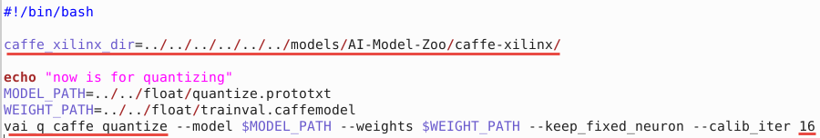
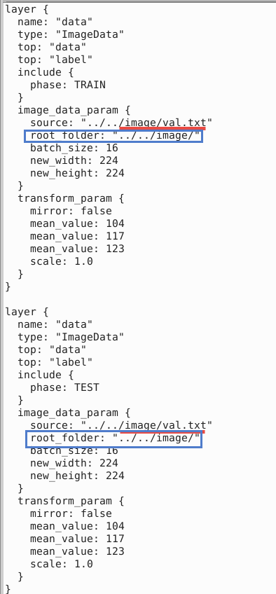

# Using Caffe Framework and Inception v1

In this lab, you will use the pretrained `Inception-v1` model with Caffe framework from the AI-Model-Zoo. It is assumed that you have an AWS F1 instance setup for the Vitis-AI version 1.4.1 otherwise refer to [AWS_README](./setup_vitisai_awsf1.md) to set one up.

Open a terminal window.

## Download the source files

We will use the pretrained `Inception-v1` network with the Caffe framework from the AI-Model-Zoo.

Download the model source files.

```sh
cd /home/ubuntu/Vitis-AI_1_4_1/models/AI-Model-Zoo/
python3 downloader.py
```

At the `input:` prompt, type `cf inceptionv1` and hit Enter. The available selections will be displayed.

Note `1` is for the board independent source files, `2` to `7` are for the various boards specific options.

Type `1` and hit Enter to download the zip file (cf_inceptionv1_imagenet_224_224_3.16G_1.4.zip).

Create a working directory called `cf_inceptionv1` under the `workspace` directory. Move the downloaded zip file in the `cf_inceptionv1` directory. Unzip the downloaded file to get `cf_inceptionv1_imagenet_224_224_3.16G_1.4` directory and associated files. Change to the unzipped directory.

```sh
mkdir /home/ubuntu/Vitis-AI_1_4_1/cf_inceptionv1
mv cf_inceptionv1_imagenet_224_224_3.16G_1.4.zip /home/ubuntu/Vitis-AI_1_4_1/cf_inceptionv1/.
cd /home/ubuntu/Vitis-AI_1_4_1/cf_inceptionv1
unzip cf_inceptionv1_imagenet_224_224_3.16G_1.4.zip
cd cf_inceptionv1_imagenet_224_224_3.16G_1.4
```

The `cf_inceptionv1_imagenet_224_224_3.16G_1.4` directory will be created with its source files.

Note the directory structure and the files under them.

```console
cf_inceptionv1_imagenet_224_224_3.16G_1.4
├── code
│   ├── gen_data
│   │   ├── gen_data.py
│   │   ├── gen_quantize_data_list.py
│   │   ├── get_dataset.sh
│   │   └── imagenet_class_index.json
│   ├── test
│   │   ├── quantize.sh
│   │   ├── quantized_test.sh
│   │   └── test.sh
│   └── train
│       ├── solver.prototxt
│       └── train.sh
├── data
│   └── demo_list.txt
├── float
│   ├── quantize.prototxt
│   ├── test.prototxt
│   ├── trainval.caffemodel
│   └── trainval.prototxt
├── quantized
│   ├── deploy.caffemodel
│   ├── deploy.prototxt
│   ├── quantize_test.prototxt
│   ├── quantize_train_test.caffemodel
│   └── quantize_train_test.prototxt
└── readme.md
```

Edit the following two files to set the directory path, change the quantizer name, and set other parameters.

1. `gedit code/test/quantize.sh`

In line 17, replace `caffe_xilinx_dir=../../../caffe-xilinx/` with `caffe_xilinx_dir=../../../../../../models/AI-Model-Zoo/caffe-xilinx/`

In line 22, replace `$caffe_xilinx_dir/build/tools/vai_q` with `vai_q_caffe` and `--calib_iter 64` with `--calib_iter 16`. Changing `calib_iter` value from *64* to *16* speeds up quantization process.

The changes should look like:


Save the changes and close the file.

2. `gedit float/quantize.prototxt`

Change line 10 from `../../data/quantize/quant.txt` to `../../image/val.txt`

Insert after line 10 (source:…) `root_folder: "../../image/"`

Change line 34 from `../../data/quantize/quant.txt` to `../../image/val.txt`

Insert after line 34 (source:…) `root_folder: "../../image/"`

Save the changes and close the file.



## Launch Docker Container

Open another terminal window and Launch Docker Container.

```sh
cd /home/ubuntu/Vitis-AI_1_4_1
./docker_run.sh xilinx/vitis-ai-cpu:1.4.1.978
```
The docker shell will start showing the following:


Activate Conda Environment.

```sh
conda activate vitis-ai-caffe
```

Note the root folder changes to `(vitis-ai-caffe) Vitis-AI /workspace>`.

DPU IP selection.

```sh
source /workspace/setup/alveo/setup.sh DPUCADF8H
```

Download a minimal validation set for [Imagenet2012](http://www.image-net.org/challenges/LSVRC/2012) using [Collective Knowledge (CK)](https://github.com/ctuning). Create a local `image` directory. Copy the `val.txt` and image files into the `image` directory using the following commands:

```sh
cd /workspace/cf_inceptionv1/cf_inceptionv1_imagenet_224_224_3.16G_1.4
mkdir image
python -m ck pull repo:ck-env
python -m ck install package:imagenet-2012-val-min
python -m ck install package:imagenet-2012-aux --tags=from.berkeley
head -n 500 ~/CK-TOOLS/dataset-imagenet-ilsvrc2012-aux-from.berkeley/val.txt > ./image/val.txt
cp ~/CK-TOOLS/dataset-imagenet-ilsvrc2012-val-min/*.JPEG image/
```

### Quantize the Model

To deploy a Caffe model on the FPGA, it needs to be quantized and compiled.

*Quantize the model*

Make sure that you are at the `/workspace/cf_inceptionv1/cf_inceptionv1_imagenet_224_224_3.16G_1.4/code/test` directory. Run the following command to run the quantizer.

```sh
cd /workspace/cf_inceptionv1/cf_inceptionv1_imagenet_224_224_3.16G_1.4/code/test
source quantize.sh
```

The following command will be executed:

```
vai_q_caffe quantize --model $MODEL_PATH --weights $WEIGHT_PATH --keep_fixed_neuron --calib_iter 16
```

| Quantizer Arguments   |                          Description                     |
|-----------------------|----------------------------------------------------------|
|    --model            | Caffe floating-point network model in *.protext file     |
|    --weights          | Weights in *.caffemodel file                             |
|  --keep_fixed_neuron  | Fixes the neurons                                        |
|    --calib_iter       | Number of iterations in calibration phase                |


Since we changed the number of calibration iterations to 16, it will take about five minutes to complete the process. With 64, it would take about 15 minutes. When the process is completed, `quantize_results` directory would have been created under the current `code/test` directory. There will be four files generated under the `quantize_results`.

```
Output Quantized Train&Test Model:   "./quantize_results/quantize_train_test.prototxt"
Output Quantized Train&Test Weights: "./quantize_results/quantize_train_test.caffemodel"
Output Deploy Weights: "./quantize_results/deploy.caffemodel"
Output Deploy Model:   "./quantize_results/deploy.prototxt"
```

The `deploy.caffemodel` and `deploy.prototxt` are the files which will be used as input parameters to the compiler.

### Compile the Model

In this step, the network graph, xmodel file, `inceptionv1.xmodel` along with `md5sum.txt` and `meta.json` will be generated in the `vai_c_output_AWS` directory under the current directory.  Note this may take approximately 2 minutes.

Execute the following command which invokes `vai_c_caffe` compiler with several input parameters.

```
vai_c_caffe -p quantize_results/deploy.prototxt -c quantize_results/deploy.caffemodel -a /opt/vitis_ai/compiler/arch/DPUCADF8H/U200/arch.json -o vai_c_output_AWS -n inceptionv1 --options '{"input_shape":"4,3,224,224"}'
```    

| Compiler Arguments  |                          Description                     |
|---------------------|----------------------------------------------------------|
|    -p MODEL         | *.prototxt file                                          |
|    -c caffemodel    | *.caffemodel file                                        |
|    -a ARCH          | Architecture JSON file                                   |
|    -o OUTPUT_DIR    | Output directory location to store the generated output  |
|    -n NET_NAME      | Prefix-name for the outputs                              |
| -options OPTIONS    | Extra options                                            |

### Run example classification code

The `inceptionv1.xmodel` is the compiled model for the *DPUCADF8H* DPU. Copy the necessary source files directory (`src`), a shell script to build the project (`build.sh`), and `words.txt` which describes various objects labels from the example directory provided as part of the repository. Finally, build the project.

```sh
cp -r /workspace/examples/DPUCADF8H/tf_inception_v1/* .
./build.sh
```
The `build.sh` script will compile the source files and generate the `inception_example` executable.

Run the compiled application using the images you downloaded into the `image` directory.

*Run*

```sh
./inception_example ./vai_c_output_AWS/inceptionv1.xmodel ../../image/
```

The output should look like:

```console
WARNING: Logging before InitGoogleLogging() is written to STDERR
I0214 10:16:32.653612   361 main.cc:293] create running for subgraph: subgraph_conv1/7x7_s2
  ...
  ...
Image : ILSVRC2012_val_00000498.JPEG
top[0] prob = 0.085024  name = waffle iron
top[1] prob = 0.066217  name = sports car, sport car
top[2] prob = 0.051570  name = swing
top[3] prob = 0.031279  name = mask
top[4] prob = 0.031279  name = ladle

Image : ILSVRC2012_val_00000237.JPEG
top[0] prob = 0.085024  name = waffle iron
top[1] prob = 0.066217  name = sports car, sport car
top[2] prob = 0.051570  name = swing
top[3] prob = 0.031279  name = mask
top[4] prob = 0.031279  name = ladle

Image : ILSVRC2012_val_00000073.JPEG
top[0] prob = 0.085024  name = waffle iron
top[1] prob = 0.066217  name = sports car, sport car
top[2] prob = 0.051570  name = swing
top[3] prob = 0.031279  name = mask
top[4] prob = 0.031279  name = ladle
```

The top five priorities are identified for each image.

You may want to close the docker image by typing `exit` in the image console.

> **Note** If the previous attempt to run the application fails with a core dump, then run `xbutil examine` and verify that the board is detected. If the board is not detected then source the setup.sh (`source /workspace/setup/alveo/setup.sh DPUCADF8H`) and run the same command to see that the board is detected. Once the board is detected, you can run the application.

---------------------------------------
<p align="center">Copyright&copy; 2022 Xilinx</p>
