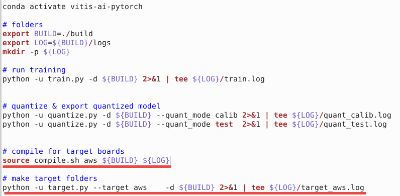
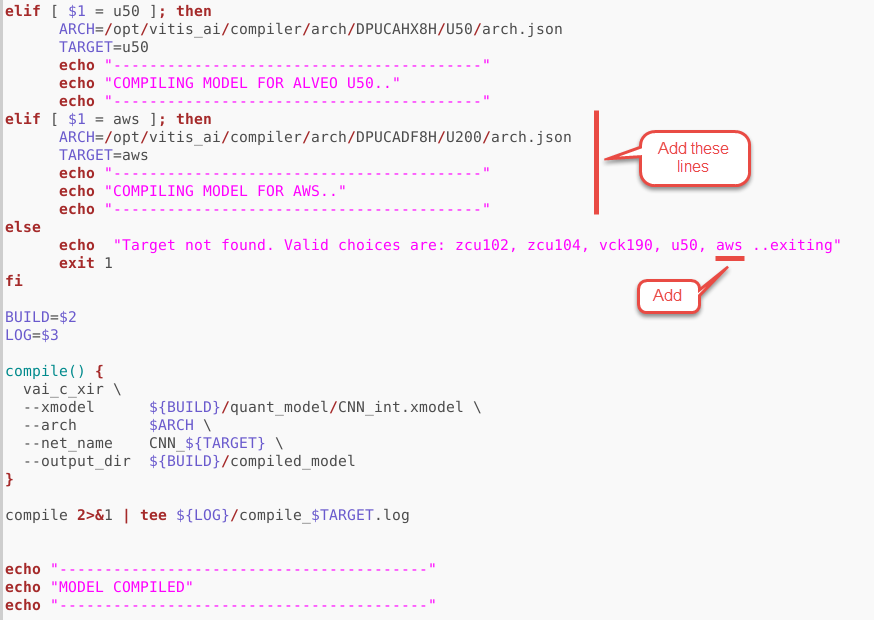
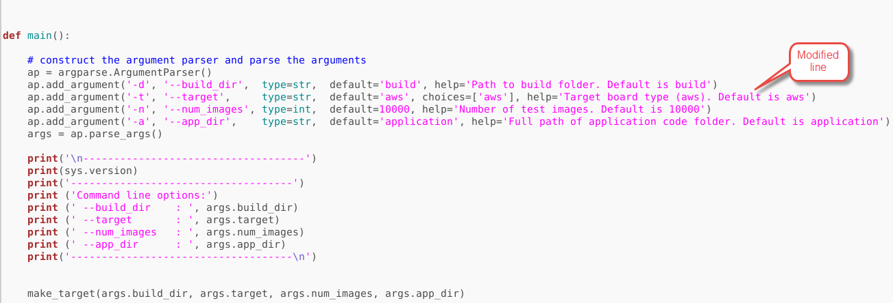
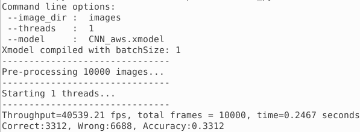

# Using PyTorch Framework and MNIST

In this lab, you will use a design example, using PyTorch framework, available as part of the [Vitis-AI-Tutorials](https://github.com/Xilinx/Vitis-AI-Tutorials).

In the following steps you will clone the `Vitis-AI-Tutorials` Git repository in your home directory and copy the `09-mnist_pyt` directory in the `~/Vitis-AI_1_4_1` directory.

Open a new terminal window.


```sh
cd
git clone https://github.com/Xilinx/Vitis-AI-Tutorials.git
cp -r Vitis-AI-Tutorials/Design_Tutorials/09-mnist_pyt/ Vitis-AI_1_4_1/.
cd Vitis-AI_1_4_1/09-mnist_pyt/files
```

## Edit run_all.sh

Edit `run_all.sh` to define AWS F1 as the target machine on which the application will run. Remove all lines in the `compile` section and then add
`source compile.sh aws ${BUILD} ${LOG}`.

Remove all lines under the `make target folders` section and then add
`python -u target.py --target aws -d ${BUILD} 2>&1 | tee ${LOG}/target_aws.log`.

The edited file content should look like:



## Edit compile.sh

Edit the `compile.sh` file to add `aws` as the target machine and define the target architecture's json file. Note that AWS F1 has the similar FPGA as Alveo U200 board. Add following lines before the `else` section:


```sh
elif [ $1 = aws ]; then
      ARCH=/opt/vitis_ai/compiler/arch/DPUCADF8H/U200/arch.json
      TARGET=aws
      echo "-----------------------------------------"
      echo "COMPILING MODEL FOR AWS.."
      echo "-----------------------------------------"
```

Add `aws` after `u50` as shown in the figure below:



## Edit target.py

Edit the `target.py` file to pass the `aws` as the target architecture and board. Modify line 101 to match the following:


```python
ap.add_argument('-t', '--target',     type=str,  default='aws', choices=['aws'], help='Target board type (aws). Default is aws')
```



## Launch Docker Container 2.0.0.1103

Open another terminal window and Launch Docker Container `2.0.0.1103` that has the updated compiler for the PyTorch. The compiler in the `1.4.1.978` container has a bug and does not produce the correct result.


```sh
cd
cd Vitis-AI_1_4_1
./docker_run.sh xilinx/vitis-ai-cpu:2.0.0.1103
```

Activate Conda Environment.


```sh
conda activate vitis-ai-pytorch
```

*Compile the model*

In the docker window, make sure the current directory is `/workspace/09-mnist_pt/files` Train, quantize, and compile the model using the `run_all.sh` script.


```sh
cd /workspace/09-mnist_pyt/files
source run_all.sh
```
When done, it will have `CNN_aws.xmodel` file generated in the `build/target_aws` directory under the current directory. It will also copy the `app_mt.py`, Python application, and `images` directory.

Note that the shell script will go through three stages of training (Epoch): write the trained model `f_model.pth` into the `./build/float_model` directory; quantize the model and generate `CNN_int.xmodel` in the `./build/quant_model/` directory; and finally generate the DPU compatible `CNN_aws.xmodel` in the `./build/target_aws` directory

## Launch Docker Container 1.4.1.978

Open another terminal window and Launch Docker Container.


```sh
cd /home/ubuntu/Vitis-AI_1_4_1
./docker_run.sh xilinx/vitis-ai-cpu:1.4.1.978
```

Activate Conda Environment and setup DPUCADF8H as DPU.


```sh
conda activate vitis-ai-pytorch
source /workspace/setup/alveo/setup.sh DPUCADF8H
```

### Run example classification code

Run the application by executing the following two commands:


```sh
cd /workspace/09-mnist_pyt/files/build/target_aws
/usr/bin/python3 app_mt.py -m CNN_aws.xmodel
```

The application will be run on the F1 hardware and you should see the output similar to whats shown below.



You may want to close the docker images by typing `exit` in the respective image console.

- [Caffe Lab using InceptionV1](./cf_inceptionv1.md)

---------------------------------------
<p align="center">Copyright&copy; 2022 Xilinx</p>
