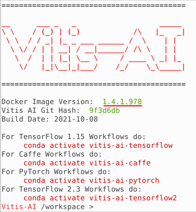

# Using Tensorflow2 Framework and Inception v3

In this lab you will use `inceptionv3` model and `imagenet` dataset with TensorFlow2 framework. It is assumed that you have an AWS F1 instance setup for the Vitis-AI version 1.4.1 otherwise refer to [AWS_README](./setup_vitisai_awsf1.md) to set one up.

## Launch Docker Container

Open a terminal window and launch Docker Container.

```sh
cd /home/ubuntu/Vitis-AI_1_4_1
./docker_run.sh xilinx/vitis-ai-cpu:1.4.1.978
```

The docker shell will start showing the following:



Activate Conda Environment for TensorFlow in the docker window.

```sh
conda activate vitis-ai-tensorflow2
```

Note the root folder changes to `(vitis-ai-tensorflow2) Vitis-AI /workspace>`.

Source DPU IP (DPUCADF8H)

```sh
source /workspace/setup/alveo/setup.sh DPUCADF8H
```

### Download a validation dataset

Download a minimal validation set for [Imagenet2012](http://www.image-net.org/challenges/LSVRC/2012) using [Collective Knowledge (CK)](https://github.com/ctuning) by executing the following steps. The images will be used to test the model.

> **Note:** User is responsible for the use of the downloaded content and compliance with any copyright licenses.

```sh
python -m ck pull repo:ck-env
python -m ck install package:imagenet-2012-val-min
python -m ck install package:imagenet-2012-aux --tags=from.berkeley
head -n 500 ~/CK-TOOLS/dataset-imagenet-ilsvrc2012-aux-from.berkeley/val.txt > ~/CK-TOOLS/dataset-imagenet-ilsvrc2012-val-min/val.txt
```

### Download the source files

We will use the pretrained `Inception-v3` network with the TensorFlow2 framework from the AI-Model-Zoo.

Download the model source files.

```sh
cd /workspace/models/AI-Model-Zoo/
python3 downloader.py
```

You will see output like:


Type `tf2 inceptionv3` and hit Enter. The available selections will be displayed.

Note `1` is for the board independent source files, `2` to `5` are for the other boards specific options.

Type `1` and hit Enter to download the zip file (tf2_inceptionv3_imagenet_299_299_11.5G_1.4.zip).

Create a working directory called `tf2_inceptionv3` under the `workspace` directory. Move the downloaded zip file in the `tf2_inceptionv3` directory. Extract the downloaded file to get `inception_v3_tf` directory and its associated files.

```sh
mkdir /workspace/tf2_inceptionv3
mv tf2_inceptionv3_imagenet_299_299_11.5G_1.4.zip /workspace/tf2_inceptionv3/.
cd /workspace/tf2_inceptionv3
unzip tf2_inceptionv3_imagenet_299_299_11.5G_1.4.zip
```

The `tf2_inceptionv3_imagenet_299_299_11.5G_1.4` directory will be created having source files.

Note the directory structure and the files under them.

```sh
tf2_inceptionv3_imagenet_299_299_11.5G_1.4
├── code
│   ├── com
│   │   ├── dataset.py
│   │   ├── imagenet_preprocessing.py
│   │   └── train_eval_h5.py
│   ├── gen_data
│   │   ├── gen_data.py
│   │   ├── get_dataset.sh
│   │   └── imagenet_class_index.json
│   ├── quantize
│   │   ├── run_quantize_by_images_h5.sh
│   │   ├── run_quantize_dump_by_images_h5.sh
│   │   └── run_quantize_eval_by_images_h5.sh
│   └── test
│       └── run_eval_by_images_h5.sh
├── data
│   ├── calib_list.txt
│   └── demo_list.txt
├── float
│   └── inception_v3_weights_tf.h5
├── quantized
│   └── quantized.h5
├── readme.md
└── requirements.txt

```

### Quantize the Model

To deploy a model on the FPGA, the network needs to be quantized and compiled.

*Quantize the model*

After calibration, the quantized model is transformed into a DPU-deployable model (named `model_name.h5` from vai_q_tensorflow2 quantizer), which follows the data format of a DPU. This model can then be compiled by the Vitis AI compiler and deployed to the DPU.

The quantizer will generate scaling parameters for quantizing `float` to `INT8`. FPGAs take advantage of Fixed Point Precision to achieve more parallelization at lower power.

Execute the following commands which changes to the working (model) directory, creates an output directory (`via_q_output`), invokes Python to quantize the model with several input parameters.

```sh
  cd tf2_inceptionv3_imagenet_299_299_11.5G_1.4
  mkdir vai_q_output
  python ./code/com/train_eval_h5.py --model ./float/inception_v3_weights_tf.h5 --quantize=true --quantize_output_dir=./vai_q_output --eval_only=true --eval_images=true --eval_image_path=/home/vitis-ai-user/CK-TOOLS/dataset-imagenet-ilsvrc2012-val-min/ --eval_image_list=/home/vitis-ai-user/CK-TOOLS/dataset-imagenet-ilsvrc2012-val-min/val.txt --label_offset=1 --gpus=0
```

| Quantizer Arguments   |                          Description                     |
|-----------------------|----------------------------------------------------------|
|    --model            | TensorFlow2 floating-point network model h5 file         |
|    --quantize         | Set to `true` to quantize                                |
| --quantize_output_dir | Output directory location to store the generated output  |
|    --eval_only        | Set it to `true` for evaluation only                     |
|    --eval_images      | Set it to `true` for images evaluation                   |
|  --eval_image_path    | Location to the evaluation images directory              |
|  --eval_image_list    | Images list                                              |
|   --label_offset      | Set to 1                                                 |
|      --gpus           | Set to 0 for CPU, set to 1 for GPU                       |          

This will take about 6 minutes. By default, the quantization result `quantized.h5` will be saved to `vai_q_output` directory under the current directory.

### Compile the Model

In this step, the network graph, xmodel file, `inception_v3_tf2.xmodel` will be generated in the `vai_q_output` directory under the current directory using the Vitis-AI compiler.  Note this may take approximately 15 minutes.

Execute the following command which invokes `vai_c_tensorflow2` compiler with several input parameters. Note the extra option is used to tell the compiler to use batch size of 4 and the image size of 299x299.

```
vai_c_tensorflow2 -m ./vai_q_output/quantized.h5 -a /opt/vitis_ai/compiler/arch/DPUCADF8H/U200/arch.json -o ./vai_q_output -n inception_v3_tf2 --options '{"input_shape": "4,299,299,3"}'
```

| Compiler Arguments  |                          Description                     |
|---------------------|----------------------------------------------------------|
|    -m MODEL         | h5 model file                                            |
|    -a ARCH          | Architecture JSON file                                   |
|    -o OUTPUT_DIR    | Output directory location to store the generated output  |
|    -n NET_NAME      | Prefix-name for the outputs                              |
|    -e OPTIONS       | Extra options                                            |

This will also take about 8 minutes.

> **Note:** DPUCADF8H uses a default batchsize of 4. If the original model's batchsize is 1, you will need to specify the `input_shape` using the `--options` argument as the command above. The `--options` is a general argument for vai\_c\_caffe/vai\_c\_tensorflow/vai\_c\_tensorflow2.

### Run example classification code

The `inception_v3_tf2.xmodel` is the compiled model for the *DPUCADF8H* DPU. Copy the necessary source files directory (`src`), a shell script to build the project (`build.sh`), and `words.txt` which describes various objects labels from the example directory provided as part of the repository. Finally, build the project.

```sh
cp -r ../../examples/DPUCADF8H/tf_inception_v3/* .
./build.sh
```

The `build.sh` script will compile the source files and generate the `inception_example` executable.

Run the compiled application using the images downloaded into the `~/CK-TOOLS` directory.

*Run*

```sh
./inception_example ./vai_q_output/inception_v3_tf2.xmodel ~/CK-TOOLS/dataset-imagenet-ilsvrc2012-val-min
```

The output should look like:

```console
WARNING: Logging before InitGoogleLogging() is written to STDERR
I0126 15:56:19.671056   491 main.cc:293] create running for subgraph: subgraph_InceptionV1/InceptionV1/Conv2d_1a_7x7/Conv2D
...
...
Image : ILSVRC2012_val_00000498.JPEG
top[0] prob = 0.024800  name = African crocodile, Nile crocodile, Crocodylus niloticus
top[1] prob = 0.009123  name = pencil box, pencil case
top[2] prob = 0.009123  name = can opener, tin opener
top[3] prob = 0.008051  name = anemone fish
top[4] prob = 0.006270  name = chain mail, ring mail, mail, chain armor, chain armour, ring armor, ring armour

Image : ILSVRC2012_val_00000237.JPEG
top[0] prob = 0.167930  name = Chesapeake Bay retriever
top[1] prob = 0.048113  name = black-and-tan coonhound
top[2] prob = 0.037470  name = Walker hound, Walker foxhound
top[3] prob = 0.037470  name = bloodhound, sleuthhound
top[4] prob = 0.025753  name = vizsla, Hungarian pointer

Image : ILSVRC2012_val_00000073.JPEG
top[0] prob = 0.160350  name = water ouzel, dipper
top[1] prob = 0.040543  name = macaw
top[2] prob = 0.035779  name = isopod
top[3] prob = 0.019151  name = king penguin, Aptenodytes patagonica
top[4] prob = 0.013162  name = little blue heron, Egretta caerulea
```

The top five priorities are identified for each image.

You may want to close the docker image by typing `exit` in the image console.

> **Note** If the previous attempt to run the application fails with a core dump, then run `xbutil examine` and verify that the board is detected. If the board is not detected then source the setup.sh (`source /workspace/setup/alveo/setup.sh DPUCADF8H`) and run the same command to see that the board is detected. Once the board is detected, you can run the application.

- [PyTorch lab using MNIST design example](./pt_mnist.md)

---------------------------------------
<p align="center">Copyright&copy; 2022 Xilinx</p>
