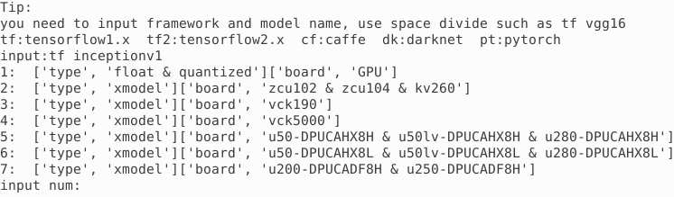

# Using Tensorflow Framework and Inception v1

In this lab you will use `inceptionv1` model and `imagenet` dataset with TensorFlow framework. It is assumed that you have an AWS F1 instance setup for the Vitis-AI version 1.4.1 otherwise refer to [AWS_README](./setup_vitisai_awsf1.md) to set one up.

## Launch Docker Container
Open a terminal window and launch Docker Container.

```sh
cd /home/ubuntu/Vitis-AI_1_4_1
./docker_run.sh xilinx/vitis-ai-cpu:1.4.1.978
```

The docker shell will start showing the following:


Activate Conda Environment for TensorFlow in the docker window.

```sh
conda activate vitis-ai-tensorflow
```

Note the root folder changes to `(vitis-ai-tensorflow) Vitis-AI /workspace>`.

Source DPU IP (DPUCADF8H).

```sh
source /workspace/setup/alveo/setup.sh DPUCADF8H
```

### Download a validation dataset

Download a minimal validation set for [Imagenet2012](http://www.image-net.org/challenges/LSVRC/2012) using [Collective Knowledge (CK)](https://github.com/ctuning) by executing the following steps. The images will be used to test the model.

> **Note:** User is responsible for the use of the downloaded content and compliance with any copyright licenses.

```sh
python -m ck pull repo:ck-env
python -m ck install package:imagenet-2012-val-min
python -m ck install package:imagenet-2012-aux --tags=from.berkeley
head -n 500 ~/CK-TOOLS/dataset-imagenet-ilsvrc2012-aux-from.berkeley/val.txt > ~/CK-TOOLS/dataset-imagenet-ilsvrc2012-val-min/val.txt
```

### Download the source files

We will use the pretrained `Inception-v1` network with the Tensorflow framework from the AI-Model-Zoo.

Download the model source files.

```sh
cd /workspace/models/AI-Model-Zoo/
python3 downloader.py
```

You will see output like:


Type `tf inceptionv1` and hit Enter. The available selections will be displayed.



Note `1` is for the board independent source files, `7` is for the U200 specific compiled files, `2` to `6` are for the other boards specific option.

Type `1` and hit Enter to download the zip file (tf_inceptionv1_imagenet_224_224_3G_1.4.zip). Move the downloaded zip file in the `tf_inception_v1` example directory. Extract the downloaded file to get  the `inception_v1_tf` directory and associated files.

```sh
mv tf_inceptionv1_imagenet_224_224_3G_1.4.zip /workspace/examples/DPUCADF8H/tf_inception_v1/.
cd /workspace/examples/DPUCADF8H/tf_inception_v1/.
unzip tf_inceptionv1_imagenet_224_224_3G_1.4.zip
```

The `tf_inceptionv1_imagenet_224_224_3G_1.4` will be created with its source files.

Copy the unquantized model file.

```sh
cp tf_inceptionv1_imagenet_224_224_3G_1.4/float/inception_v1_inference.pb .
```

The `inception_v1_inference.pb` is the unquantized Tensorflow trained model with data in `float` format.

### Inspect TensorFlow model

Inspect the Tensorflow model to get input and output node(s), and input node shape.

```sh
./inspect_tf_model.sh inception_v1_inference.pb
```

You should see the output as:

```console
Op types used: 297 Const, 231 Identity, 58 Conv2D, 57 FusedBatchNormV3, 57 Relu, 13 MaxPool, 9 ConcatV2, 2 Reshape, 1 AvgPool, 1 BiasAdd, 1 Placeholder, 1 Shape, 1 Softmax, 1 Squeeze

Found 1 possible inputs: (name=input, type=float(1), shape=[?,224,224,3])
Found 1 possible outputs: (name=InceptionV1/Logits/Predictions/Reshape_1, op=Reshape)
```

### Quantize the Model

To deploy a model on the FPGA, it must be quantized (into INT8 data format) and compiled.

*Quantize the model*

The quantizer will generate scaling parameters for quantizing `float` to `INT8`. FPGAs take advantage of Fixed Point Precision to achieve more parallelization at lower power.

Execute the following command which invokes `vai_q_tensorflow` quantizer program with several input parameters.

```sh
vai_q_tensorflow quantize --input_frozen_graph inception_v1_inference.pb --input_nodes input --output_nodes InceptionV1/Logits/Predictions/Reshape_1 --input_fn utils.input_fn_inception_v1_tf --input_shapes ?,224,224,3 --calib_iter 50
```

where the arguments are:

| Quantizer Arguments   |                          Description                     |
|-----------------------|----------------------------------------------------------|
| --input_frozen_graph  | TensorFlow floating-point network model `pb` file        |
|  --input_nodes        | input function name (`input`)                       |
|   --output_nodes      | Output function name (`InceptionV1/Logits/Predictions/Reshape_1`)  |
|     --input_fn        | Function defined in the utils.py                    |
|   --input_shapes      | 224x224 pixels image in RGB format                   |
|  --eval_image_path    | Location to the evaluation images directory              |
|    --calib_iter       | Number of images on which to calibrate                        |

The `calib_iter` will have impact on the quality of results. The smaller the number, the poorer the probabilities will be.

By default, the quantization result (quantized model `quantize_eval_model.pb`) will be saved to `quantize_results` directory under the current directory.

### Compile the Model

In this step, the network graph, xmodel file, `tf_inception_v1_compiled.xmodel` will be generated in the `out` directory under the current directory using the Vitis-AI compiler.  Note this may take approximately 5-8 minutes.

Execute the following command which invokes `vai_c_tensorflow` compiler with several input parameters

```sh
vai_c_tensorflow --arch /opt/vitis_ai/compiler/arch/DPUCADF8H/U200/arch.json --frozen_pb quantize_results/quantize_eval_model.pb --output_dir out --net_name tf_inception_v1_compiled --options '{"input_shape": "4,224,224,3"}'
```
where the arguments are:

| Compiler Arguments  |                          Description                     |
|---------------------|----------------------------------------------------------|
|    --arch           | Architecture JSON file                                   |
|    --frozen_pb      | Quantized network  |
|   --output_dir      | Output directory name                              |
|    --net_name       | compiled network name                                   |
|    --options        | Extra options including defining `input_shape`      |

The input_shape parameters of `4,224,224,3` means process four images of 224x224 pixels in RGB format.

> **Note:** DPUCADF8H uses a default batchsize of 4. If the original model's batchsize is 1, you will need to specify the `input_shape` using the `--options` argument as the command above. The `--options` is a general argument for vai\_c\_caffe/vai\_c\_tensorflow/vai\_c\_tensorflow2.

### Run example classification code

In the current directory there is a `src` folder with source files which will be run on the host. Compile the host code using the provided `build` shell script.

*Compile the executable*

```sh
./build.sh
```

The compiled executable called `inception_example` will be generated in the current directory.

Run the compiled application using the images downloaded into the `~/CK-TOOLS` directory.

*Run*

```sh
./inception_example ./out/tf_inception_v1_compiled.xmodel ~/CK-TOOLS/dataset-imagenet-ilsvrc2012-val-min
```

The output should look like:

```console
WARNING: Logging before InitGoogleLogging() is written to STDERR
I0126 15:56:19.671056   482 main.cc:293] create running for subgraph: subgraph_InceptionV1/InceptionV1/Conv2d_1a_7x7/Conv2D
...
...
Image : ILSVRC2012_val_00000498.JPEG
top[0] prob = 0.549440  name = common newt, Triturus vulgaris
top[1] prob = 0.084259  name = centipede
top[2] prob = 0.065621  name = eft
top[3] prob = 0.024141  name = spotted salamander, Ambystoma maculatum
top[4] prob = 0.014642  name = European fire salamander, Salamandra salamandra

Image : ILSVRC2012_val_00000237.JPEG
top[0] prob = 0.451046  name = English foxhound
top[1] prob = 0.351275  name = Walker hound, Walker foxhound
top[2] prob = 0.047540  name = Great Dane
top[3] prob = 0.028834  name = English setter
top[4] prob = 0.012020  name = German short-haired pointer

Image : ILSVRC2012_val_00000073.JPEG
top[0] prob = 0.295080  name = kite
top[1] prob = 0.157945  name = sulphur-crested cockatoo, Kakatoe galerita, Cacatua galerita
top[2] prob = 0.108554  name = vulture
top[3] prob = 0.045252  name = papillon
top[4] prob = 0.035242  name = bald eagle, American eagle, Haliaeetus leucocephalus
```

The top five priorities are identified for each image. The names it displays comes from `words.txt` provided in the repository directory. Its offset is provided in `val.txt` under the `~/CK-TOOLS/dataset-imagenet-ilsvrc2012-val-min` downloaded dataset. Execute the following command to see the label number for the `ILSVRC2012_val_00000498.JPEG`:

```sh
cat ~/CK-TOOLS/dataset-imagenet-ilsvrc2012-val-min/val.txt | grep 00000498  
```

You should see the output as `ILSVRC2012_val_00000498.JPEG 26`, indicating label offset for the file is 26.

You may want to close the docker image by typing `exit` in the image console.

> **Note** If the previous attempt to run the application fails with a core dump, then run `xbutil examine` and verify that the board is detected. If the board is not detected then source the setup.sh (`source /workspace/setup/alveo/setup.sh DPUCADF8H`) and run the same command to see that the board is detected. Once the board is detected, you can run the application.

- [TensorFlow2 Lab using InceptionV3](./tf2_inceptionv3.md)

---------------------------------------
<p align="center">Copyright&copy; 2022 Xilinx</p>
