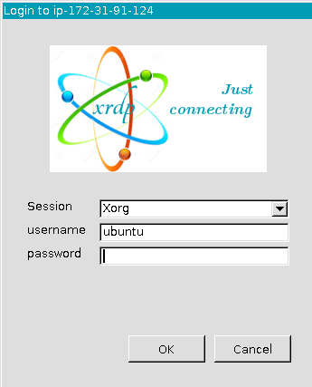

# Instructor-led XUP tutorial: Connecting to AWS

The following instructions are for live, instructor-led XUP tutorials where AWS F1 instances have been set by Xilinx and login details have been provided to attendees. You can check the [XUP workshop schedule](https://www.xilinx.com/support/university/workshops/schedule.html) for upcoming training. Ask your instructor if you do not have your login details. If you are **not** attending a live XUP tutorial, go back to the [Quick Start](README.md) page and follow one of the other options to work through these labs.

## Introduction

This lab will show you how to start, stop, and connect to a preconfigured AWS EC2 F1 instance. 

## Objectives

After completing this lab, you will be able to:

- Connect to an AWS EC2 F1 instance using the provided credentials.
- Start the instance.
- Connect to the instance using remote desktop.
- Stop the instance.
- Run the [pre lab setup](#lab-setup) to configure *AWS-FPGA* and *XRT* for the instance.

## Steps

Each registered participant to this Xilinx tutorial has been allocated a pre-configured EC2 F1 instance. You should have received an email with the following details:  

- Account ID.
- IAM username.
- Link to access a pre-configured EC2 F1 instance.

### Login into the AWS and starting an F1 instance

1. Follow the link provided by your instructor, or go to [https://console.aws.amazon.com/ec2](https://console.aws.amazon.com/ec2). 

    If you see the login page for *Root user*, click the link to sign in to a different account. 

1. Select **IAM user** and use the account ID provided by your instructor (E.g. `xilinx-aws-f1-developer-labs`) in *Account ID (12 digits) or account alias*. 

    

1. Use the username and password provided by your instructor.

1. In the top right corner make sure to select the AWS region specified by your instructor (E.g. N. Virginia).

    

    If the wrong region is selected you will not be able to see your instance.

1. Click on the **Services** in the menu bar at the top of the screen and click on **EC2** to see the available instances.

    
    
    You can also click on the **Instances** link on the left panel
    
    
    
    You may see several instances.

1. Find the instance that matches your username. If you need to check your username, the account you are logged in as is visible in the menu bar at the top of the screen. 

    You can enter your *username* in the *Filter instances* box to filter the list.

    

1. Select your instance (tick the checkbox) and click on **Instance state > Start**.

    

1. Click on the refresh button to check the status of the instance. It will take about a few seconds before the instance is ready. 

    

    Keep refreshing the status until you see the *Instance state* update to **Running**. This means the instance is now ready for you to connect to it.  

    

1. With your instance selected, view the instance *Details* in the bottom part of the page. You can resize the page to make this section easier to view. Find the *Public IPv4 address* and copy it. Notice the copy button that will automatically copy the IP address to your clipboard. 

    This address will be used by to access the remote instance.

    

## Connect to your remote instance

Your instance has been preconfigured to allow you to connect to a remote desktop for your instance using **only** RDP. 

You can also ssh to AWS instances (E.g. using PuTTY) if you only need a terminal. See [Appendix: ssh using PuTTY](#ssh-using-putty) for details.

### Connect using RDP

The following instructions are for Windows *Remote Desktop Connection* (pre-installed on Windows 10 and recent versions). For Mac VNC is recommended (see the next section). For Linux you can use *Remmina* or *Vinagre* (search for instructions on how to install this for your OS). Detailed instructions are not provided for Linux. You can follow the steps below and carry out the corresponding actions in your Linux RDP client.  

1. Search for Remote Desktop Connection in the windows start menu, and open it to start a session.

1. Enter the *IPv4 Public IP* address for your instance.

1. Click on the **Show Options**.

    

1. Select the **Display** tab and select *True Color (24 bit)* and click **Connect**.

    

1. A certificate warning will be displayed. Click **Yes** to open the RDP session.

1. Enter the **RDP credentials** you were provided with, enter **ubuntu** as a username and click **OK**.

  

Known issues:

  - If the color depth is not set to True Color(24 bit) some programs are not displayed properly.

---------------------------------------

## Appendix

### SSH using PuTTY

1. Start **PuTTY** or your preferred SSH client.

1. Enter *ubuntu@<IPv4\_Public\_IP>* in the **Host Name** field and **22** in the *Port* field.
    Make sure that SSH is selected as the Connection type.

    

1. Click **Open** and then **Yes** when PuTTY Security Alert is shown.

    The PuTTY window will open. It will ask for the password (in case of the workshop). Enter the provided password.

    

1. Enter **exit** to close the session.

---------------------------------------

Copyright&copy; 2022 Xilinx

